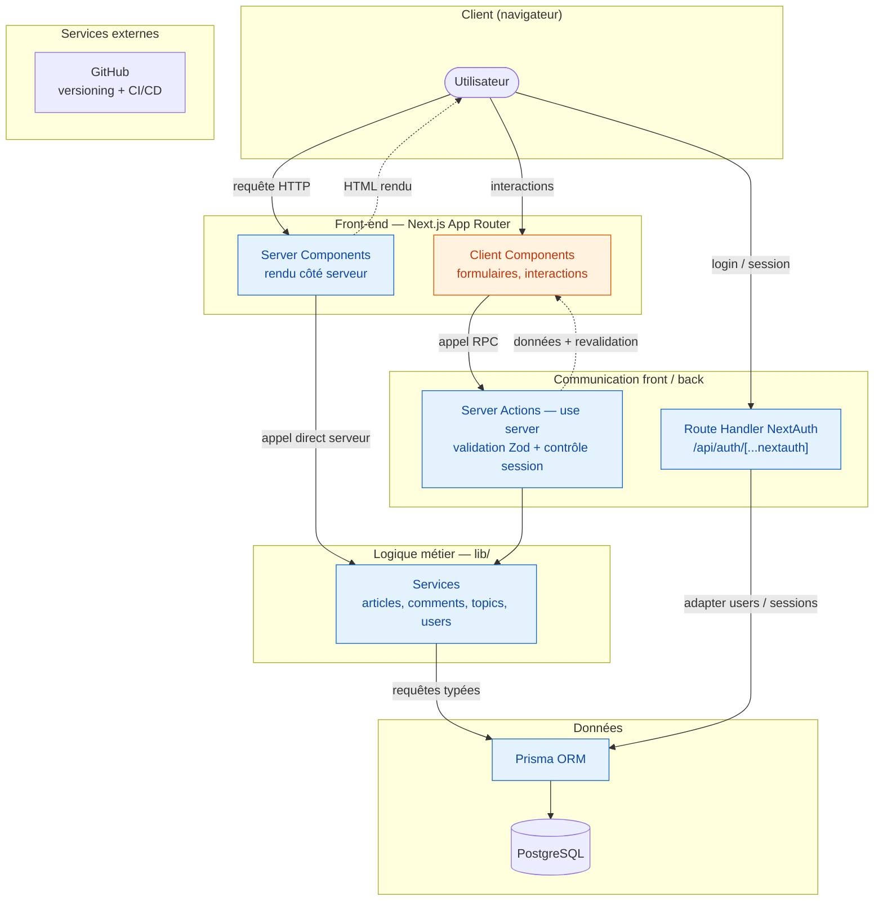
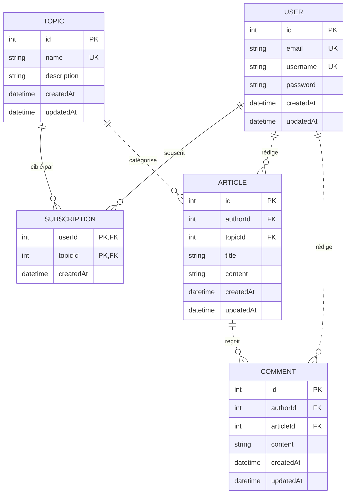

Auteur : **Vincent VANWAELSCAPPEL**\
Version : **0.0.8**\
Date : **27/06/2026**

# Documentation et rapport du projet MDD

## Sommaire

1. [Présentation générale du projet](#presentation-generale)
    1. [Objectifs du projet](#objectifs)
    2. [Périmètre fonctionnel](#perimetre-fonctionnel)
2. [Architecture et conception technique](#architecture)
    1. [Schéma global de l'architecture](#schema-architecture)
    2. [Choix techniques](#choix-techniques)
    3. [API et schémas de données](#api-donnees)
3. [Tests, performance et qualité](#tests-qualite)
    1. [Stratégie de test](#strategie-test)
    2. [Rapport de performance et optimisation](#performance)
    3. [Revue technique](#revue-technique)
4. [Documentation utilisateur et supervision](#documentation-utilisateur)
    1. [FAQ utilisateur](#faq)
    2. [Supervision et tâches déléguées à l'IA](#supervision-ia)
5. [Annexes](#annexes)

---

## 1. Présentation générale du projet

### 1.1 Objectifs du projet

Développer un MVP (Minimum Viable Product) d'un réseau social dédié aux développeurs : Monde de Dév (MDD). Ce réseau
social a pour but de les aider à trouver un emploi, à collaborer, à s'informer en les mettant en relation et en leur
permettant de partager leurs savoirs.

Chaque utilisateur pourra poster des articles sur diverses thématiques. Chaque utilisateur peut également s'abonner à
une ou plusieurs de ces thématiques. Il verra alors dans son fil d'actualités les contenus des thématiques auxquelles il
est abonné, dans l'ordre chronologique. Il sera par ailleurs possible de commenter des articles.

### 1.2 Périmètre fonctionnel

Présentez les **fonctionnalités livrées** (liste synthétique), en précisant leur état (terminée / en cours / à venir).

| Fonctionnalités                            | Description                                                                                                                                        | Statut   |
|:-------------------------------------------|:---------------------------------------------------------------------------------------------------------------------------------------------------|:---------|
| **Création d'un compte utilisateur**       | Formulaire et validation d'inscription                                                                                                             | Terminée |
| **Authentification**                       | Authentification sécurisée par mot de passe, hash du mot de passe, pose du cookie de session                                                       | Terminée |
| **Déconnexion**                            | Suppression du cookie                                                                                                                              | Terminée |
| **Consulter son profil utilisateur**       | Afficher les informations associées à son compte et ses abonnements                                                                                | Terminée |
| **Modifier ses informations de connexion** | Modifier email, nom d'utilisateur et mot de passe                                                                                                  | Terminée |
| **Liste des thèmes**                       | Afficher la liste des thèmes et leur status "abonné" pour l'utilisateur                                                                            | Terminée |
| **Abonnement/Désabonnement à un thème**    | Dans le profil utilisateur, se désabonner d'un thème. Dans la liste des thème s'abonner/se désabonner des thème                                    | Terminée |
| **Rédiger un article**                     | Ecrire un article associé à un thème                                                                                                               |          |
| **Lire le fil d'actualités**               | Lister les articles associés aux thèmes auxquels l'utilisateur a souscrit. Ordonner les articles par date de publication (ascendant ou descendant) | Terminée |
| **Lire un article**                        | Consulter un article et ses commentaires.                                                                                                          |          |
| **Ecrire un commentaire**                  | Ecrire un commentaire associé à un article                                                                                                         |          |

---

## 2. Architecture et conception technique

### 2.1 Schéma global de l'architecture

**Légende.** En bleu, le code exécuté côté serveur (Server Components, Server Actions, Route Handler, services métier,
Prisma) ; en orange, le code envoyé au navigateur (Client Components). Trait plein = appel ou flux de données ;
pointillés = réponse renvoyée au client. Les Client Components déclenchent des **Server Actions** — qui valident les
entrées via Zod et vérifient la session avant d'appeler un service `lib/` — tandis que les Server Components appellent
directement les services côté serveur. L'authentification passe par le **Route Handler** dédié de NextAuth.

**Organisation technique.** Le routage et les composants vivent dans `app/` (App Router : un dossier par segment d'URL,
les Server Actions au plus près de leur usage dans des fichiers `actions.ts`). La logique métier est isolée dans `lib/`,
à raison d'un dossier par domaine (`lib/articles/`, `lib/comments/`, `lib/topics/`, `lib/users/`), chacun regroupant son
service, ses schémas Zod et ses types. Ce découplage rend la logique réutilisable par n'importe quel transport (Server
Action aujourd'hui, Route Handler demain) et testable en isolation.

### 2.2 Choix techniques

| Éléments choisis   | Type                             | Lien documentation                                                                                                | Objectif du choix                                                                                          | Justification                                                                                        |
|:-------------------|:---------------------------------|:------------------------------------------------------------------------------------------------------------------|:-----------------------------------------------------------------------------------------------------------|:-----------------------------------------------------------------------------------------------------|
| **Typescript**     | Langage                          | https://www.typescriptlang.org/docs/                                                                              | Langage au typage strict                                                                                   | Détecter les erreurs avant l'exécution                                                               |
| **Next.js, React** | Framework Full-stack             | https://nextjs.org/docs https://react.dev/learn https://nextjs.org/docs/app/getting-started/updating-data | Architecture unifiée, Server Components et Server Actions (communication front/back sans API REST séparée) | Performance, typage de bout en bout, moins de code de liaison ; logique métier découplée dans `lib/` |
| **PostgreSQL**     | Moteur de Base de données        | https://www.postgresql.org/docs/                                                                                  | Persistance des données                                                                                    | Performances, support des transactions                                                               |
| **Prisma**         | Object-relational mappings (ORM) | https://www.prisma.io/docs https://www.prisma.io/docs/guides/frameworks/nextjs                                | Couche d'abstraction des données                                                                           | Abstraction des requêtes, agnostique au moteur de BDD sous-jacent, typage et migrations générés      |
| **Zod**            | Validation                       | https://zod.dev/                                                                                                  | Validation des données                                                                                     | Simplicité et lisibilité de la syntaxe, une source de vérité (cf. z.infer)                           |
| **NextAuth.js**    | Bibliothèque d'authentification  | https://next-auth.js.org/getting-started/introduction                                                             | Sécurisation de l'application                                                                              | Support d'un vaste choix de méthodes d'authentification (future proof)                               |
| **Tailwind**       | Framework CSS                    | https://tailwindcss.com/docs                                                                                      | Styliser rapidement                                                                                        | Gestion du responsive, styles et composants regroupés via classes utilitaires                        |
| **GitHub**         | Collaboration                    | https://www.github.com                                                                                            | Versionning du code, collaboration, CI                                                                     | Gratuit, standard de l'industrie                                                                     |

### 2.3 API et schémas de données

La logique serveur suit le principe de l'App Router, qui sépare nettement écritures et lectures :

* **Mutations → Server Actions** (`"use server"`, fichiers `*.action.ts`) : déclenchées depuis les formulaires / boutons
  des Client Components. Elles **valident** (Zod), **contrôlent la session**, délèguent au service métier, puis
  **redirigent** ou **revalident le cache**. Elles ne renvoient un état JSON que pour réafficher une erreur de
  formulaire (`useActionState`).
* **Lectures → Server Components** : il n'y a **pas** de Server Action de lecture. Les pages serveur appellent
  directement la couche service (`lib/**/*.service.ts`), qui renvoie les données au rendu — une lecture n'a pas besoin
  du round-trip d'une action.
* **Authentification → Route Handler** `/api/auth/[...nextauth]` (NextAuth) ; `signIn` / `signOut` sont déclenchés côté
  client (cf. §2.1), pas via une Server Action dédiée.

**Server Actions (mutations)**

| Server Action       | Opération                      | Entrée                                               | Retour / effet                                                                          |
|:--------------------|:-------------------------------|:-----------------------------------------------------|:----------------------------------------------------------------------------------------|
| `registerAction`    | Inscription                    | FormData (username, email, password)                 | `redirect` `/login?registered=1` ; sinon `RegisterState` (message d'erreur)             |
| `profileAction`     | Mise à jour du profil connecté | FormData (username, email, password optionnel)       | `ProfileState` `{success, values}` + `revalidatePath('/profile')` ; sinon état d'erreur |
| `postAction`        | Publication d'un article       | FormData (topicId, title, content)                   | `redirect` `/article/{id}?created=1` ; sinon `PostState` (erreur)                       |
| `commentAction`     | Ajout d'un commentaire         | `articleId` (lié via `.bind()`) + FormData (content) | `redirect` `/article/{id}?comment=1` ; sinon `CommentState` (erreur)                    |
| `subscribeAction`   | Abonnement à un thème          | `topicId` (lié via `.bind()`)                        | `void` + `revalidatePath` (`/topics`, `/feed`, `/profile`)                              |
| `unsubscribeAction` | Désabonnement d'un thème       | `topicId` (lié via `.bind()`)                        | `void` + `revalidatePath` (`/topics`, `/feed`, `/profile`)                              |

Les erreurs *attendues* (Zod, `AppError`) sont traduites en message par le helper commun `toActionError`
(`lib/actionError.ts`).

**Lectures (Server Components → couche service)**

| Méthode service                             | Opération                                | Page / usage                          |
|:--------------------------------------------|:-----------------------------------------|:--------------------------------------|
| `articlesService.getFeedArticles(order?)`   | Articles des thèmes suivis, tri par date | `/feed`                               |
| `articlesService.getArticleById(id)`        | Article + auteur + thème + commentaires  | `/article/[id]`                       |
| `topicsService.getTopicsWithSubscription()` | Tous les thèmes + statut d'abonnement    | `/topics`                             |
| `topicsService.getSubscribedTopics()`       | Thèmes suivis de l'utilisateur           | `/profile`                            |
| `topicsService.getAllTopics()`              | Tous les thèmes (sans statut)            | menu déroulant de rédaction d'article |

*Reste à implémenter : la lecture du profil de l'utilisateur connecté (`getUserProfile` du périmètre initial), pour la
page `/profile` ; l'identité provient déjà de la session via `getCurrentUserId`.*

Le diagramme entité-association ci-dessous représente les modèles Prisma et leurs relations.

**Légende.** `PK` = clé primaire, `FK` = clé étrangère, `UK` = contrainte d'unicité. Le symbole `||--o{` se lit « un et
un seul » côté barre, « zéro ou plusieurs » côté patte d'oie. Trait plein = relation **identifiante** (la clé étrangère
fait partie de la clé primaire) : c'est le cas de `SUBSCRIPTION`, dont la clé composite `(userId, topicId)` matérialise
l'abonnement et interdit tout doublon. Trait pointillé = relation **non identifiante** (la clé étrangère est un simple
attribut), pour les liens auteur et catégorie. La table `SUBSCRIPTION` porte la relation plusieurs-à-plusieurs entre
`USER` et `TOPIC` (cf. `NOTES.md` pour la justification de ce choix).

---

## 3. Tests, performance et qualité

### 3.1 Stratégie de test

La couche **logique côté serveur** (services, repositories, DTO Zod, Server
Actions, gestion d'erreurs) est testée en priorité, car c'est elle qui porte les
règles métier (unicité, validation du mot de passe, identité issue de la session,
404 sur article inexistant…). Les composants React et les pages relèvent des
tests **e2e**, prévus dans un second temps.

Deux niveaux complémentaires, sous **Vitest** :

* **Unitaire** — chaque service est testé isolément : le client Prisma est
  remplacé par un mock profond (`vitest-mock-extended`) et la session
  (`getCurrentUserId`) est stubée. Les tests traversent les *vrais* repositories
  (injectés par défaut dans les services), qui sont donc couverts sans base
  réelle. S'y ajoutent les schémas Zod, le helper `toActionError`, `AppError`,
  la configuration NextAuth (`authorize`, callbacks) et les Server Actions.
* **Intégration** — les mêmes services rejoués contre une **vraie base
  PostgreSQL éphémère** (Testcontainers, image `postgres:16-alpine`, migrations
  Prisma appliquées au démarrage) : on valide les requêtes réelles, les
  contraintes d'unicité, les `include` de relations et le double abonnement sans
  doublon. Nécessite Docker.

Seuil de couverture fixé à **75 %** (statements / branches / functions / lines)
sur la couche `src/lib` + `src/errors` ; **atteint** : ~99 % des instructions et
~81 % des branches sur le périmètre testé (75 tests unitaires).

Un troisième niveau, **end-to-end** (Playwright), pilote l'application complète
dans un navigateur (Chromium) sur les parcours critiques du brief : l'app est
lancée par Playwright, une base PostgreSQL jetable est préparée puis semée avant
la suite, et la session est mutualisée via un état d'authentification enregistré.
Comme l'intégration, il nécessite Docker (PostgreSQL).

Commandes : `npm test` (unitaire), `npm run test:coverage` (couverture),
`npm run test:integration` (intégration, Docker requis), `npm run test:e2e`
(end-to-end, Docker requis).

| Type de test       | Outil / framework                    | Portée                                                                                                                     | Résultats                                           |
|:-------------------|:-------------------------------------|:---------------------------------------------------------------------------------------------------------------------------|:----------------------------------------------------|
| Test unitaire      | Vitest + vitest-mock-extended        | Services, repositories, DTO, Server Actions, auth, erreurs                                                                 | 75 tests ✓ — couverture ~99 % stmts / 81 % branches |
| Test d'intégration | Vitest + Testcontainers (PostgreSQL) | Services rejoués sur vraie base (relations, contraintes, double abonnement sans doublon)                                   | 13 tests (exécution locale, Docker requis)          |
| Test e2e           | Playwright (Chromium)                | Parcours critiques : inscription, connexion, fil + tri, abonnement, article, commentaire, profil, déconnexion, 404, mobile | 16 tests (exécution locale, Docker requis)          |

### 3.2 Rapport de performance et optimisation

Décrivez les actions menées pour **améliorer la performance** du code et du rendu :

* résultats d'audit (Lighthouse, Vercel Analytics, etc.),
* points d'amélioration identifiés,
* actions correctives appliquées.
* accessibilité (aria-label), wave ?

Qualité et conformité réglementaire des interfaces front-end

Le code respecte les règles d’accessibilité web (ex : ARIA, contrastes, navigation clavier).
Les composants respectent les bonnes pratiques de qualité et de sécurité.
Les interfaces sont documentées et illustrées dans la documentation (ex : captures d’écran, composants clés identifiés).

*Exemple : "Après audit Lighthouse, la performance est passée de 65 à 95/100 grâce à l'utilisation du composant
Next/Image et au rendu statique partiel (PPR)."*

### 3.3 Accessibilité

L'accessibilité a été mesurée via les audits **Lighthouse** (catégorie *Accessibility*) et **Wave**
complétés par un test manuel de la **navigation au clavier** sur les parcours
principaux. L'audit initial plafonnait à **96/100** ; les corrections décrites
ci-dessous ont permis d'atteindre **100/100**. Des erreurs dans Wave ont été relevées. Les corrections
ont permis d'atteindre **10/10** sur toutes les pages

#### Points relevés

* **Piège au clavier absent sur le menu mobile** : une fois le panneau de
  navigation (burger) ouvert, la tabulation pouvait s'échapper vers le contenu
  situé derrière l'overlay, alors que ce contenu était visuellement masqué. Le
  focus se « perdait » hors du dialogue, en infraction avec les critères WCAG
  *2.1.2 (No Keyboard Trap)* et *2.4.3 (Focus Order)*.
* **Éléments focusables dans une zone masquée** : le panneau, maintenu monté pour
  l'animation de glissement, conservait ses liens dans l'ordre de tabulation même
  fermé
* **Fermeture du menu peu accessible** : le panneau ne proposait pas de commande
  de fermeture explicite et clairement atteignable au clavier.
* **Champs sans labels** : la maquette ne prévoyait pas de labels sur les champs
  de rédaction des articles et commentaires.

#### Actions correctives appliquées

* **Piège à focus** : le panneau est désormais un véritable dialogue modal
  (`role="dialog"`, `aria-modal="true"`) dont le focus clavier est confiné par la
  bibliothèque **`focus-trap-react`**. Tant que le menu est ouvert, `Tab` /
  `Shift+Tab` bouclent à l'intérieur ; le focus entre dans le panneau à l'ouverture
  et revient au bouton burger à la fermeture. Les touches *Échap* et un clic sur
  l'overlay le referment.
* **Mise à l'écart de la zone fermée** : le bricolage `tabIndex` conditionnel par
  élément est remplacé par l'attribut `inert` posé sur le conteneur lorsque le menu
  est fermé, le retirant d'un seul tenant du clavier, des clics et de l'arbre
  d'accessibilité.
* **Bouton de fermeture explicite** : ajout d'une croix (`aria-label="Fermer le
  menu"`, `aria-keyshortcuts="Escape"`) en tête du panneau, et annonce de l'état du
  burger via `aria-expanded` / `aria-haspopup="dialog"`.
* **Lien de navigation redondant** : un item pointant vers la page courante est
  désormais rendu comme un `` non cliquable plutôt qu'un
  lien vers soi-même (suppression de l'alerte *redundant link* de WAVE et
  signalement de la position courante aux lecteurs d'écran).
* **Labels de formulaire** : les champs du formulaire de rédaction d'article
  (thème, titre, contenu) reçoivent un `<label>` relié par `htmlFor`/`id`, en
  complément du placeholder, supprimant l'alerte *missing form label* de WAVE.

---

### 3.4 Revue technique

Synthèse critique du code à l'état actuel du projet.

#### Points forts

* **Typage strict de bout en bout** : `strict` activé, types Prisma générés et
  partagés entre la couche d'accès aux données et le front. Les entrées des
  Server Actions sont validées par Zod (`RegisterSchema`, `UpdateProfileSchema`,
  `ArticleSchema`, `CommentSchema`) avant tout contact avec la base.
* **Séparation des responsabilités** : découpage par domaine en
  `repository` / `service` / `dto` sous `src/lib/`. L'identité de l'utilisateur
  provient systématiquement de la session (`getCurrentUserId`), jamais d'un
  paramètre client, ce qui ferme la porte à l'usurpation d'identité par
  falsification de formulaire.
* **Gestion d'erreur centralisée** : le mapping erreur → message des Server
  Actions est factorisé dans `src/lib/actionError.ts` (`toActionError`),
  supprimant la duplication des blocs `catch` Zod / `AppError`.

#### Points à améliorer

* **Charge utile du fil d'actualité** : `ArticleCard` tronque l'extrait *à
  l'affichage* via `line-clamp-4` (CSS `-webkit-line-clamp`), mais le contenu
  intégral de chaque article transite malgré tout dans le HTML envoyé au client.
  Pour un fil dense, cela gonfle inutilement la charge réseau. Acceptable au
  périmètre du MVP (volume de seed limité) ; à traiter par un extrait calculé
  côté serveur (`excerpt` borné, coupé sur un espace) si la volumétrie augmente.
* **Course résiduelle (TOCTOU)** : le pré-check d'existence de la relation dans
  `addArticle` / `addComment` laisse une fenêtre entre la vérification et
  l'insertion. La contrainte de clé étrangère en base reste le garde-fou réel.
* **Politique de mot de passe** : la borne `max(20)` est un héritage à
  questionner ; elle n'apporte rien sur le plan de la sécurité.

#### Actions correctives appliquées

* Centralisation des schémas Zod et du helper d'erreur (`actionError.ts`).
* Correction de `getArticleById` (appelait `repo.feed` au lieu de
  `repo.findById`) et durcissement des écritures (validation Zod + insertion
  typée en `*UncheckedCreateInput` + pré-check d'existence renvoyant un 404
  propre plutôt qu'un 500 sur violation de clé étrangère).
* Mutualisation du formulaire de compte (`AccountForm`) entre inscription et
  profil, paramétré par props (mot de passe requis ou non).

---

## 4. Documentation utilisateur et supervision

### 4.1 FAQ utilisateur

Rédigez une courte section d'aide destinée aux utilisateurs internes ou finaux. Structurez-la en format **Question /
Réponse**.

Q : Comment créer un compte ?

R : Cliquez sur "S'inscrire", remplissez le formulaire et validez. Vous serez automatiquement connecté.

Q : Que faire si l'application ne charge pas ?

R : Rafraîchissez la page. Si le problème persiste, vérifiez votre connexion ou contactez le support technique.

### 4.2 Supervision et tâches déléguées à l'IA

Décrivez les tâches confiées à l'IA ou à des collaborateurs juniors, et comment vous avez **revérifié, validé ou corrigé
** leur travail.

| Tâche déléguée                                                                                                                                                                                                                                     | Outil / collaborateur | Objectif                                                                                                                                      | Vérification effectuée                                                                                                                                                                                                                                                                                                                                                                                |
|:---------------------------------------------------------------------------------------------------------------------------------------------------------------------------------------------------------------------------------------------------|:----------------------|:----------------------------------------------------------------------------------------------------------------------------------------------|:------------------------------------------------------------------------------------------------------------------------------------------------------------------------------------------------------------------------------------------------------------------------------------------------------------------------------------------------------------------------------------------------------|
| Mise en place de la documentation (sommaire cliquable, ancres PDF-compatibles, fichiers de suivi)                                                                                                                                                  | Claude                | Documentation navigable et traçabilité du projet                                                                                              | Ouverture de `DOCUMENTATION.md` sur GitHub, test de chaque lien du sommaire et relecture du contenu généré                                                                                                                                                                                                                                                                                            |
| Revue critique du tableau des choix techniques (complétude, justifications, ordre, coquilles)                                                                                                                                                      | Claude                | Crédibiliser la section « Choix techniques »                                                                                                  | Validation point par point des remarques, arbitrage des reformulations conservées et relecture du tableau final                                                                                                                                                                                                                                                                                       |
| Génération des diagrammes ERD et d'archtecture                                                                                                                                                                                                     | Claude                | Réalisation de diagrammes compatibles avec mon IDE et Github dans la documentation                                                            | Validation de la suggestion du format mermaid, vérification de la cohérence et lisibilité des diagrammes                                                                                                                                                                                                                                                                                              |
| Rédaction des données de démonstration du seed (6 utilisateurs, 63 articles de 3 paragraphes, 3 commentaires par article)                                                                                                                          | Claude                | Disposer d'un jeu de données réaliste pour développer et tester le fil et le détail d'un article                                              | Vérification des champs face à `schema.prisma`, contrôle de l'idempotence (upsert users + purge/recréation articles et commentaires), respect de la règle « commentaires postés par des non-auteurs distincts », conformité du mot de passe de dev à la politique du brief et relecture du contenu rédigé                                                                                             |
| Intégration des pages connectées sur la couche métier : `/topics`, `/profile`, `/feed` puis détail d'article `/article/[id]` (lecture + formulaire de commentaire) et primitives associées (`AccountForm`, `ArticleCard`, `TopicCard`, `Textarea`) | Claude                | Brancher le front sur les services et Server Actions déjà en place                                                                            | Relecture du flux `getArticleById` → rendu → `commentAction.bind()`, confrontation à la maquette, contrôle du `notFound()` sur id invalide/article absent et de l'ordre des arguments liés `(articleId, prev, formData)`, cohérence des lectures avec le tableau des server actions                                                                                                                   |
| Mise en place de la suite de tests Vitest (unitaires + intégration) sur la couche serveur                                                                                                                                                          | Claude                | Tester la logique métier et atteindre le seuil de couverture de 75 %                                                                          | Exécution de `npm run test:coverage` (75 tests au vert, ~99 % stmts / 81 % branches) et `tsc --noEmit` sans erreur ; relecture des assertions face au comportement attendu (codes 401/404/409, mot de passe haché jamais en clair, identité issue de la session, double abonnement sans doublon) ; vérification que les tests d'intégration ciblent bien le conteneur Postgres et non le `.env` local |
| Rédaction du README.md sur la base du template proposé                                                                                                                                                                                             | Claude                | Résumer le contenu du projet et donner les commandes et opération principales permettant de lancer le projet et de reprendre le développement | Confrontation de chaque section au code réel (`package.json`, `docker-compose.yml`, `.env.example`, `prisma.config.ts`, arborescence `src/`), test des procédures mentionnées                                                                                                                                                                                                                         |

---

## 5. Annexes

Intégrez ici toutes les pièces justificatives :

* **Captures d'écran de l'UI** et vues principales.
* **Analyse des besoins front-end** (liens avec les spécifications ou maquettes).
* **Définition des données** (schémas Prisma, types TypeScript, règles Zod).
* **Rapports de couverture et de tests** (exports ou impressions d'écran).
* **Rapport de revue technique** (version complète, datée et signée si applicable).
